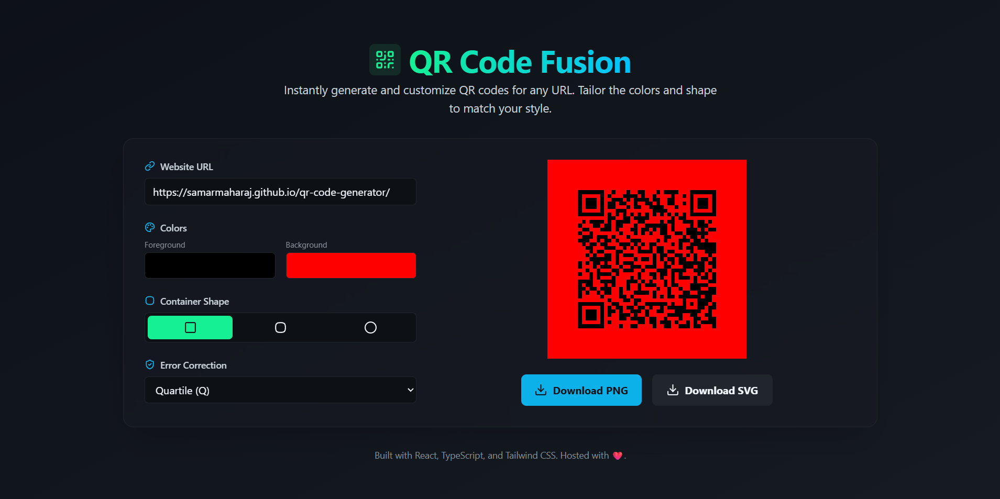
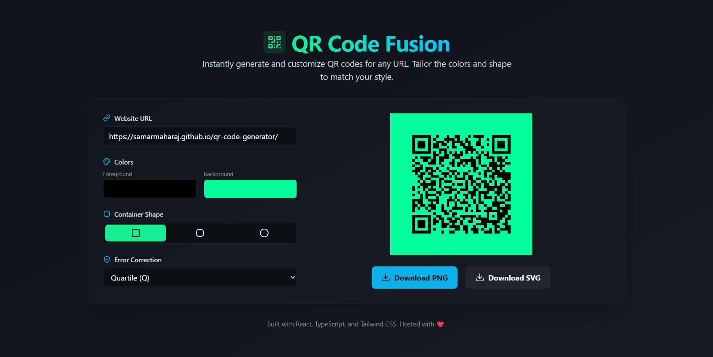

# QR Code Fusion - Local Tool

This project is a local-only tool that combines QR code generation with optional overlay images and styles.

## Features

- Generate QR codes from text or URLs
- Apply custom colors, sizes, and overlays
- 100% local execution (no internet or AI services required)

## How to Run

1. **Extract the ZIP file** you received.
2. Open the extracted folder.
3. Locate the main HTML file (e.g., `index.html`).
4. **Double-click** the HTML file to open it in your browser.
5. Start generating your QR codes directly from the interface.

> **Note:** No server or installation is required. Everything runs in your browser locally.

## Adding Screenshot

---

# Run and deploy your AI Studio app

This contains everything you need to run your app locally.

## Run Locally

**Prerequisites:**  Node.js

1. Install dependencies:
   `npm install`
2. Set the `GEMINI_API_KEY` in [.env.local](.env.local) to your Gemini API key
3. Run the app:
   `npm run dev`
---

**Author:** Samar Maharaj
